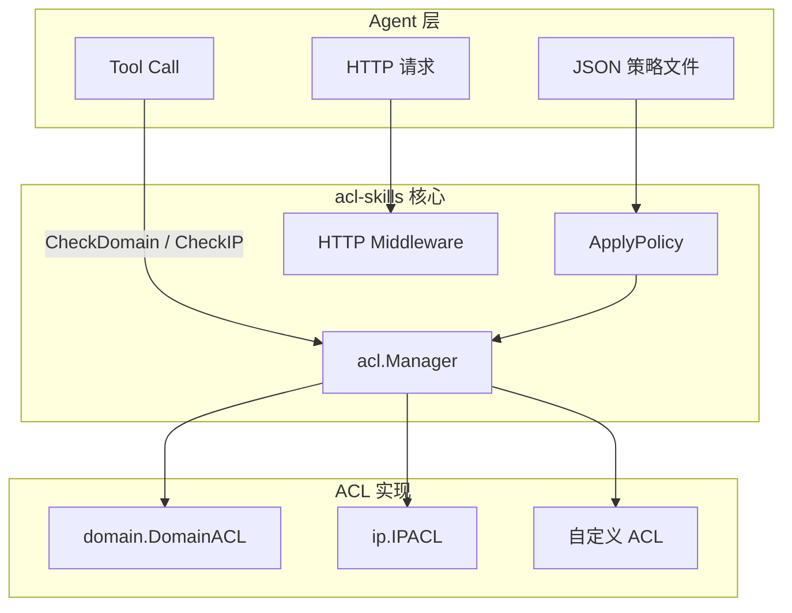

# 欢迎使用 acl-skills

**acl-skills** 是一个为 AI Agent 设计的 Go 访问控制列表（ACL）库，零外部依赖，提供域名与 IP 双维度访问控制，保护 Agent 的出向请求免受 SSRF 攻击和未授权访问。

## 它解决什么问题

AI Agent 在执行工具调用（tool use）时会发起 HTTP 请求。若没有访问控制，攻击者可通过 Prompt Injection 将 Agent 引导访问内部服务、云元数据端点或数据外泄目标。acl-skills 要做的事只有一件：**在请求发出之前，把 Agent 不该访问的目标拦下来**——无论是内网 IP、云元数据端点、恶意域名，还是伪装成可信域名的 DNS rebinding。

## 解决得怎么样

真实基准（`go test -bench=. -benchmem`，Go 1.25）：

| 检查 | 延迟 | 内存分配 |
|------|------|----------|
| `Manager.CheckIP`（CIDR 前缀树） | **~60 ns/op** | 0 allocs |
| `Manager.CheckDomain`（精确匹配） | **~78 ns/op** | 0 allocs |
| `Manager.MixedCheck`（双维度一次查） | **~74 ns/op** | 0 allocs |
| `DomainACL.Check` 万级规则 | **~75 ns/op**（与规则数无关） | 0 allocs |

万级规则下的查询耗时**恒定**：域名精确匹配是 O(1) 哈希查找，IP 走前缀树 O(prefixLen)。对一次真实 HTTP 请求而言，每次出站检查的开销可以忽略不计。完整测试见 [`README.md`](https://github.com/cyberspacesec/acl-skills/blob/main/README.md)。

## 实战案例（先看这个）

想知道它到底怎么拦攻击，直接看可运行的案例——每个都来自 `examples/` 目录，`go run` 就能跑：

| 案例 | 解决什么问题 | 效果 |
|------|--------------|------|
| [案例 1：AI Agent 的 SSRF 攻防](cases/case-1-agent-ssrf.md) | Prompt Injection 引导 Agent 访问云凭证/内网 | 无防护全部放行 → 接入后全部拦截，正常请求不受影响 |
| [案例 2：一份策略文件接管整个 Web 服务](cases/case-2-middleware-policy.md) | 已有 HTTP 服务出站安全裸奔 | 一行中间件挂载，域名/IP 双维度 403 |
| [案例 3：域名模式规则拦截数据外泄](cases/case-3-domain-pattern.md) | 出站流量按域名形态精细化管控 | 精确/子域/前缀/后缀/正则五种匹配，不误伤正常域名 |

## 为什么 Agent 需要 ACL？

AI Agent 在执行工具调用（tool use）时会发起 HTTP 请求。若没有访问控制，攻击者可通过 Prompt Injection 将 Agent 引导访问内部服务、云元数据端点或数据外泄目标。

| 风险 | 无 ACL | 有 acl-skills |
|------|--------|--------------|
| SSRF（用户提供 URL） | Agent 访问内网服务 | 请求发出前即被拦截 |
| 数据外泄 | Agent POST 到攻击者服务器 | 域名黑名单命中拦截 |
| 云凭证窃取 | Agent 访问 `169.254.169.254` | CloudMetadata 预设集阻断 |
| 工具滥用 | 无法限制 Agent 可调用的目标 | 按 kind 独立 ACL 管控 |

## 快速接入（SSRF 防护）

```go
import (
    "github.com/cyberspacesec/acl-skills/pkg/acl"
    "github.com/cyberspacesec/acl-skills/pkg/ip"
    "github.com/cyberspacesec/acl-skills/pkg/types"
)

manager := acl.NewManager()

// 一行阻断所有 Agent 不应访问的地址
manager.SetIPACLWithDefaults(nil, types.Blacklist, []ip.PredefinedSet{
    ip.PrivateNetworks,   // 10.x、192.168.x、172.16.x
    ip.LoopbackNetworks,  // 127.x、::1
    ip.CloudMetadata,     // 169.254.169.254
    ip.DockerNetworks,    // 172.17.x
}, false)

// 在 Agent 的 HTTP dial 钩子中检查
func agentDial(network, addr string) (net.Conn, error) {
    host, _, _ := net.SplitHostPort(addr)
    if perm, _ := manager.CheckIP(host); perm == types.Denied {
        return nil, fmt.Errorf("acl: blocked %s", host)
    }
    return net.Dial(network, addr)
}
```

## 架构概览



## 核心特性

| 特性 | 说明 |
|------|------|
| 🛡️ **SSRF 防护** | 内置私有网络、云元数据、回环地址等预定义黑名单集合 |
| 🚀 **高性能** | `CheckIP` ~61ns、`CheckDomain` ~82ns，万级规则查询耗时恒定，**零内存分配** |
| 🌐 **双维度** | 域名（精确/子域/前缀/后缀/正则）+ IP（CIDR/区间/IPv6） |
| 📦 **零依赖** | 纯 Go 标准库实现，`go get` 即用 |
| 🧵 **并发安全** | 内置 `sync.RWMutex`，不同 ACL kind 互不阻塞 |
| ⚙️ **灵活集成** | HTTP 中间件、JSON Policy 配置、文件持久化、自定义 ACL 扩展 |

## 下一步

- [实战案例](cases/intro.md) — 三个可运行的攻防案例，看它是怎么拦的
- [安装](quickstart/installation.md) — 一行安装，零外部依赖
- [域名 ACL](quickstart/domain-acl.md) — 为 Agent 配置域名白/黑名单
- [IP ACL](quickstart/ip-acl.md) — SSRF 防护与预定义集合
- [HTTP 中间件](quickstart/middleware.md) — 一行接入 Agent 服务
- [核心架构](architecture.md) — 深入了解设计
